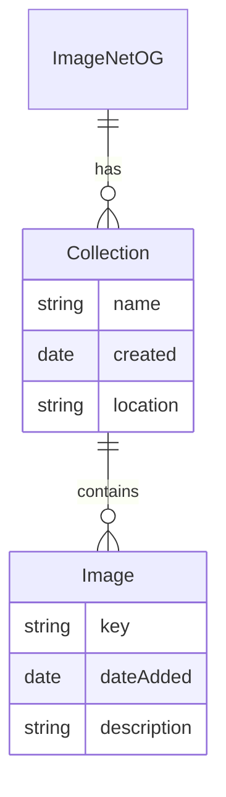

# ImageNetOG Redux — API Requirements (Draft)

## General

**REQ-1.** Ubiquitous: the system shall be written in Python and be compatible with Python 3.12+.

**REQ-2.** Ubiquitous: the system provides a read-only RESTful API for end users with resources based on the following data model:

**REQ-3.** Ubiquitous: all endpoints are versioned under a `/v1/` path prefix.

**REQ-4.** Ubiquitous: API endpoints shall be designed to be intuitive and follow RESTful conventions, using the GET method only, with appropriate status codes for success and error cases (see REQ-15).

**REQ-5.** Ubiquitous: creation, modification, and deletion of collections and images is out of scope for this API. All ingestion is performed via the administrative tooling described in architecture-draft.md §4 (collection-creation script, CLI-driven image upload).

**REQ-6.** Ubiquitous: the system shall provide comprehensive API documentation as an OpenAPI (Swagger) specification, including endpoint descriptions, request/response schemas, and example usage.

**REQ-7.** Ubiquitous: every endpoint shall require a valid authentication token; unauthenticated requests shall be rejected. The specific token issuance/validation mechanism (e.g., Cognito JWT) is an implementation detail left to design.md.

## Pagination, Filtering, and Sorting

**REQ-8.** Ubiquitous: all API endpoints that return lists shall support pagination, filtering, and sorting.

**REQ-9.** Ubiquitous: list endpoints shall default to a page size of 20 items and accept a `limit` query parameter capped at 100 items per page.

**REQ-10.** Ubiquitous: collections shall be sortable by `name` or `created`; images shall be sortable by `dateAdded`. Requesting an unsupported sort field shall return a 400 error.

## Collections

**REQ-11.** WHEN a user wishes to know what collections are available, THEN the system shall provide a list of collections with their names and creation dates. The system will allow the user to filter collections by name (exact match or begins-with) and/or creation date. For each collection returned in the list, the name of the collection and the date it was created is included in the response. Internal fields (e.g., underlying storage location) are not included in the response.

## Images and Search

**REQ-12.** WHEN a user wishes to know what images are available in a collection, THEN the system shall provide a list of images with their keys, dates added, and descriptions. The system will allow the user to filter images by date added. The user may provide a description qualifying the search to return images that are similar to the provided description, using vector similarity search (see architecture-draft.md §5). Internal fields (e.g., underlying storage location) are not included in the response.

> Example: return all the images in the collection "Animals" that were added after January 1, 2023, containing cats.

**REQ-13.** WHEN a user queries images in a collection with both a date filter and a description, THEN the system shall first narrow the candidate set using the date filter, then rank the narrowed set by vector similarity to the description, returning the top 20 results by default (configurable via the `limit` parameter from REQ-9, capped at 100).
>
> This is a proposed default resolving an ambiguity between this document
> and architecture-draft.md §5 — confirm or adjust before it becomes
> authoritative.

**REQ-14.** WHEN a user wishes to retrieve a specific image in a collection identified using its key, THEN the system shall return a temporary URL to the image file, valid for a limited time (default 5 minutes). The system will ensure that the temporary URL is secure and cannot be used to access the image after it expires.

## Error Handling

**REQ-15.** WHEN a request references a collection or image key that does not exist, an expired or invalid temporary-URL request, malformed filter/sort parameters, or an unauthenticated/unauthorized request, THEN the system shall return an appropriate 4xx status code and a structured error response identifying the failure reason.

## Non-Functional

**REQ-16.** Ubiquitous: the system shall enforce rate limiting on API requests to protect against abuse. Specific limits are an implementation detail to be defined in design.md (e.g., via API Gateway usage plans, per architecture-draft.md §2).
