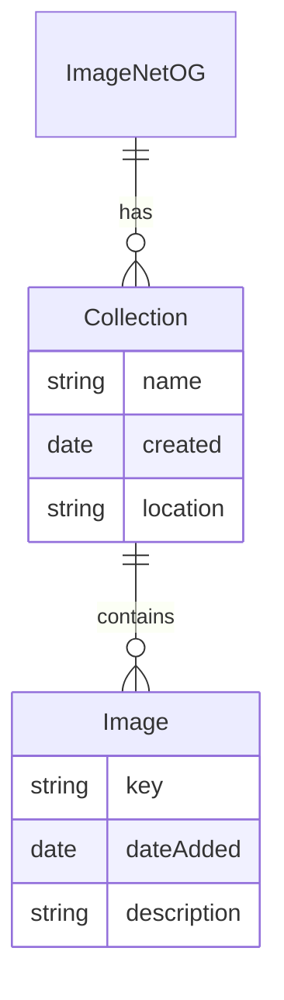

Ubiquitous: the system shall be written in Python and be compatible with Python 3.12+.

Ubiquitous: the system provides a read-only RESTful API for end users with resources based on the following data model:

Ubiquitous: all API endpoints the return lists shall support pagination, filtering, and sorting.

Ubiquitous: API endpoints shall be designed to be intuitive and follow RESTful conventions, using standard HTTP methods (GET, POST, PUT, DELETE) and appropriate status codes.

Ubiquitous: the system shall provide comprehensive API documentation, including endpoint descriptions, request/response formats, and example usage.

Ubiquitous: the system shall implement authentication mechanisms to ensure that only authorized users can access and collections and images.

WHEN a user wishes to know what collections are available,
THEN the system shall provide a list of collections with their names and creation dates. The system will allow the user to filter collections by name (exact match or begins-with) and/or creation date. For each collection returned in the list the name of the collection and the date it was created is included in the response.

WHEN a user wishes to know what images are available in a collection,
THEN the system shall provide a list of images with their keys, dates added, and descriptions. The system will allow the user to filter images by date added. The user may provide a description qualifying the search to return images that are similar to the provided description.

Example: return all the images in the collection "Animals" that were added after January 1, 2023, containing cats.

WHEN a user wishes to retrieve a specific image in a collection identified using its key, the system will return a temporary URL to the image file, valid for a limited time (e.g., 5 minutes). The system will ensure that the temporary URL is secure and cannot be used to access the image after it expires.