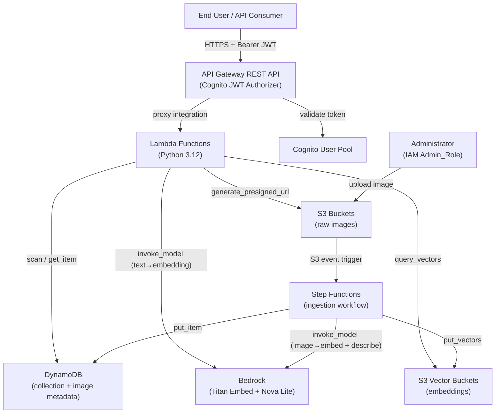
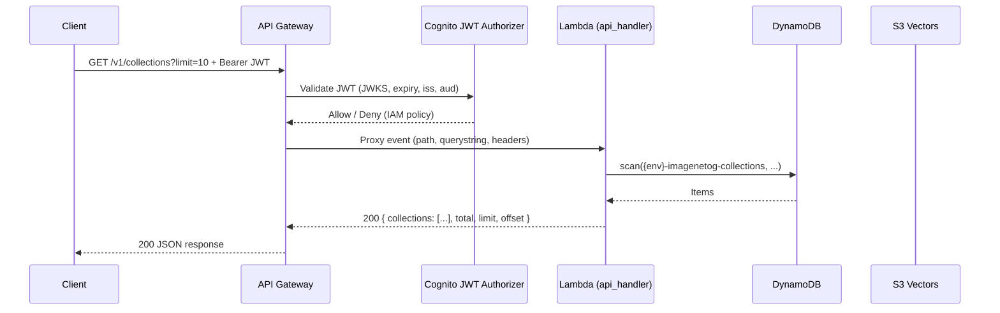
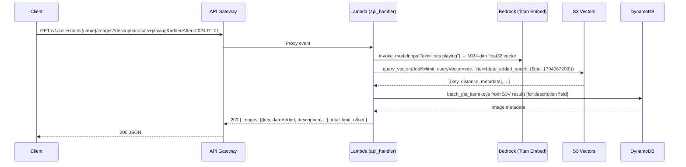
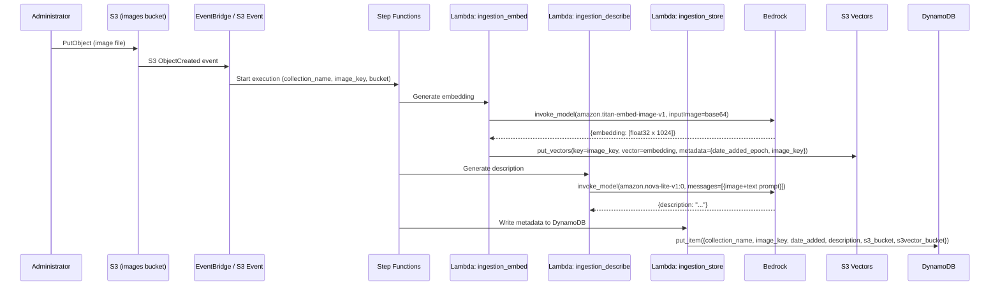

# Design Document: ImageNetOG Redux — AWS Deployment

## Overview

ImageNetOG Redux is a read-only REST API deployed on AWS that serves authenticated users access to curated image collections. Each collection stores raw images in S3, vector embeddings in S3 Vectors, and metadata in DynamoDB. The API supports collection discovery, image listing and description-based search, and time-limited presigned URL retrieval. Image ingestion and collection provisioning are handled by out-of-scope administrative tooling but are described here because they produce the data structures the API consumes.

**Key design decisions carried forward from the architecture draft:**

- Compute: AWS Lambda (Python 3.12+) behind API Gateway
- Auth: AWS Cognito JWT Authorizer on every endpoint
- Storage: S3 (raw images), S3 Vectors (embeddings), DynamoDB (metadata)
- Ingestion orchestration: AWS Step Functions
- Embedding model: Amazon Titan Multimodal Embeddings G1 (`amazon.titan-embed-image-v1`), 1,024-dimension output
- Description model: Amazon Nova Lite (`amazon.nova-lite-v1:0`), low-cost multimodal vision model
- IaC: Terraform, us-east-1, three environments (dev / staging / prod)

---

## Architecture

### System Context Diagram



### Deployment Topology

```
us-east-1
├── API Gateway (REST API, /v1/*)
│   └── Cognito JWT Authorizer
│       └── Usage Plan (rate limiter)
├── Lambda: api_handler (routes all /v1/* endpoints)
├── DynamoDB: {env}-imagenetog-collections
├── DynamoDB: {env}-imagenetog-images
├── S3 Bucket: {env}-imagenetog-{collection_name}-images  (per collection)
├── S3 Vector Bucket: {env}-imagenetog-{collection_name}-vectors  (per collection)
│   └── Vector Index: images  (cosine, 1024-dim, float32)
├── Step Functions: {env}-imagenetog-ingestion
├── Lambda: ingestion_embed  (embedding step)
├── Lambda: ingestion_describe  (description step)
├── Lambda: ingestion_store  (DynamoDB write step)
└── Cognito: {env}-imagenetog-userpool
```

### Request Flow — Authenticated API Call



### Request Flow — Vector Search



### Ingestion Flow



---

## Components and Interfaces

### Component: `api_handler` Lambda

The single Lambda function implementing all `/v1/*` endpoints. It uses [AWS Lambda Powertools for Python](https://docs.aws.amazon.com/powertools/python/latest/core/event_handler/api_gateway/) (`APIGatewayRestResolver`) to route requests.

**Responsibilities:**
- Route validation (`/v1/` prefix enforcement, HTTP method enforcement)
- Query parameter parsing and validation (pagination, filters, sort)
- DynamoDB queries for collection and image metadata
- Bedrock embedding invocation for description-based searches
- S3 Vectors queries for similarity search
- S3 presigned URL generation
- Structured JSON error response production

**Environment variables:**

| Variable | Description |
|---|---|
| `COLLECTIONS_TABLE` | DynamoDB table name for collections |
| `IMAGES_TABLE` | DynamoDB table name for images |
| `AWS_REGION` | AWS region (injected by runtime) |
| `COGNITO_USER_POOL_ID` | Cognito User Pool ID (for reference; auth is done at gateway) |
| `EMBED_MODEL_ID` | Bedrock model ID for text embeddings (`amazon.titan-embed-image-v1`) |
| `PRESIGNED_URL_TTL_SECONDS` | Presigned URL TTL in seconds (default: `300`) |

**Router structure:**
```
GET /v1/collections                            → list_collections()
GET /v1/collections/{collection_name}          → get_collection()
GET /v1/collections/{collection_name}/images   → list_images()
GET /v1/collections/{collection_name}/images/{image_key}  → get_image()
```

### Component: `ingestion_embed` Lambda

Reads the image from S3, generates a 1,024-dimension float32 embedding using `amazon.titan-embed-image-v1`, and writes the vector with metadata to the collection's S3 Vectors index.

**Input (from Step Functions):**
```json
{
  "collection_name": "string",
  "image_key": "string",
  "s3_bucket": "string",
  "s3vector_bucket": "string",
  "date_added_epoch": 1234567890
}
```

**Actions:**
1. `s3.get_object(Bucket, Key)` → raw image bytes
2. Base64-encode image bytes
3. `bedrock_runtime.invoke_model(modelId="amazon.titan-embed-image-v1", body={"inputImage": b64, "embeddingConfig": {"outputEmbeddingLength": 1024}})`
4. `s3vectors.put_vectors(vectorBucketName, indexName="images", vectors=[{key: image_key, data: {float32: embedding}, metadata: {date_added_epoch: int, image_key: str}}])`

### Component: `ingestion_describe` Lambda

Generates a natural-language description of an image using Amazon Nova Lite.

**Input (from Step Functions):** Same as `ingestion_embed`.

**Actions:**
1. `s3.get_object(Bucket, Key)` → raw image bytes
2. Base64-encode image bytes
3. `bedrock_runtime.invoke_model(modelId="amazon.nova-lite-v1:0", body={"messages": [{"role": "user", "content": [{"image": {"format": "jpeg|png", "source": {"bytes": b64}}}, {"text": "Describe this image concisely in 1-3 sentences."}]}]})`
4. Extract description string from response

### Component: `ingestion_store` Lambda

Writes the complete image metadata record to DynamoDB.

**Input (from Step Functions):**
```json
{
  "collection_name": "string",
  "image_key": "string",
  "s3_bucket": "string",
  "s3vector_bucket": "string",
  "date_added": "2024-01-15",
  "date_added_epoch": 1705276800,
  "description": "string or null"
}
```

**Actions:**
1. `dynamodb.put_item(TableName=IMAGES_TABLE, Item={collection_name, image_key, date_added, date_added_epoch, description, s3_bucket, s3vector_bucket})`

### Component: Step Functions State Machine

Orchestrates the three ingestion Lambda functions with error handling and retry logic.

**State Machine definition (simplified ASL):**
```
ParallelEmbedAndDescribe:
  - EmbedBranch: ingestion_embed (Retry: 2x, Catch: IngestionError)
  - DescribeBranch: ingestion_describe (Retry: 2x, Catch: IngestionError)
StoreMetadata:
  - ingestion_store (Retry: 2x, Catch: IngestionError)
```

Running embed and describe in parallel reduces total ingestion latency.

### Component: Cognito JWT Authorizer

Attached to all API Gateway routes. Validates:
1. Token signature against Cognito JWKS endpoint (`https://cognito-idp.us-east-1.amazonaws.com/{pool_id}/.well-known/jwks.json`)
2. Token expiry (`exp` claim)
3. Issuer (`iss` claim matches User Pool URL)
4. Audience (`aud` claim matches app client ID)

On failure, returns HTTP 401. Authorization decision is cached by API Gateway for configurable TTL (default 300 seconds) to reduce Cognito calls.

### Component: Collection Script (`scripts/create_collection.py`)

Administrative script accepting `--collection-name` as input. Creates:
1. S3 image bucket: `{env}-imagenetog-{collection_name}-images`
2. S3 Vector bucket: `{env}-imagenetog-{collection_name}-vectors`
3. S3 Vectors index within the vector bucket: `images` (cosine, 1024-dim, float32; metadata keys `date_added_epoch` and `image_key` are filterable by default)
4. DynamoDB item in the collections table with `name`, `created`, `s3_bucket`, and `s3vector_bucket`

**Naming convention** (enforced by the script):
- Collection name: lowercase alphanumeric + hyphens, 3–48 characters
- S3 bucket: `{env}-imagenetog-{collection_name}-images`
- S3 Vector bucket: `{env}-imagenetog-{collection_name}-vectors`
- DynamoDB PK: `collection_name` (exact value supplied)

---

## Data Models

### DynamoDB: Collections Table (`{env}-imagenetog-collections`)

| Attribute | Type | Description |
|---|---|---|
| `collection_name` (PK) | String | Unique collection identifier; lowercase alphanumeric + hyphens |
| `created` | String | ISO 8601 date string (YYYY-MM-DD) |
| `created_epoch` | Number | Unix timestamp (seconds) of creation; used for range queries |
| `s3_bucket` | String | S3 bucket name for raw images (internal; never returned by API) |
| `s3vector_bucket` | String | S3 Vector bucket name (internal; never returned by API) |

**DynamoDB indexes:**
- Primary key: `collection_name` (hash)
- GSI `created_epoch-index`: hash = `_type` (constant `"COLLECTION"`), range = `created_epoch` — enables efficient date-range scans

### DynamoDB: Images Table (`{env}-imagenetog-images`)

| Attribute | Type | Description |
|---|---|---|
| `collection_name` (PK) | String | Parent collection identifier |
| `image_key` (SK) | String | Unique image identifier within the collection (S3 object key) |
| `date_added` | String | ISO 8601 date string (YYYY-MM-DD) |
| `date_added_epoch` | Number | Unix timestamp (seconds); used for range queries and S3V metadata filter sync |
| `description` | String (nullable) | Natural-language description generated by Nova Lite |
| `s3_bucket` | String | S3 bucket name (internal; never returned by API) |
| `s3vector_bucket` | String | S3 Vector bucket name (internal; never returned by API) |

**DynamoDB indexes:**
- Primary key: `collection_name` (hash) + `image_key` (sort)
- LSI `date_added_epoch-index`: hash = `collection_name`, range = `date_added_epoch` — enables efficient date-range filtering within a collection

### S3 Vectors Index Schema

Each collection's vector bucket contains a single index named `images`.

**Index configuration:**
- `dataType`: `float32`
- `dimension`: `1024`
- `distanceMetric`: `cosine`
- `metadataConfiguration.nonFilterableMetadataKeys`: *(none)* — all metadata keys are filterable

**Vector record:**
```json
{
  "key": "path/to/image.jpg",
  "data": { "float32": [/* 1024 floats */] },
  "metadata": {
    "date_added_epoch": 1705276800,
    "image_key": "path/to/image.jpg"
  }
}
```

`date_added_epoch` is stored as a Number type, enabling S3 Vectors `$gte` / `$lte` metadata filters for date-range queries during vector search (no pre-filtering required in Lambda).

### API Response Schemas

#### Collection list item (public view)
```json
{
  "name": "nature-2024",
  "created": "2024-01-15"
}
```

#### Paginated list envelope
```json
{
  "items": [...],
  "total": 142,
  "limit": 20,
  "offset": 0
}
```

#### Image list item (public view)
```json
{
  "key": "uploads/img_001.jpg",
  "dateAdded": "2024-01-15",
  "description": "A mountain landscape at dusk with snow-capped peaks."
}
```

#### Presigned URL response
```json
{
  "key": "uploads/img_001.jpg",
  "url": "https://{bucket}.s3.amazonaws.com/uploads/img_001.jpg?X-Amz-Expires=300&..."
}
```

#### Error response
```json
{
  "error": "resource.not_found",
  "message": "Collection 'nature-2024' does not exist."
}
```

**Error token taxonomy:**

| Token | HTTP Status | Trigger |
|---|---|---|
| `resource.not_found` | 404 | Collection or Image_Key does not exist |
| `param.invalid` | 400 | Malformed, out-of-range, or unsupported parameter |
| `auth.unauthorized` | 401 | Missing, invalid, or expired JWT |
| `method.not_allowed` | 405 | Non-GET HTTP method on any endpoint |
| `rate_limit.exceeded` | 429 | API Gateway usage plan quota exceeded |
| `server.error` | 500 | Unhandled internal exception |

---

## API Endpoint Specifications

All endpoints are under `/v1/` and require a valid `Authorization: Bearer <JWT>` header.

### GET /v1/collections

Returns a paginated, sortable, filterable list of collections.

**Query parameters:**

| Parameter | Type | Default | Constraints |
|---|---|---|---|
| `limit` | integer | 20 | 1–100; 400 if exceeded |
| `offset` | integer | 0 | ≥ 0 |
| `sort` | string | `name` | `name` or `created`; 400 for others |
| `order` | string | `asc` | `asc` or `desc` |
| `name` | string | — | Case-insensitive prefix match |
| `createdAfter` | string | — | ISO 8601 date (YYYY-MM-DD) |
| `createdBefore` | string | — | ISO 8601 date (YYYY-MM-DD); must be ≥ `createdAfter` |

**Success response (200):**
```json
{
  "items": [
    { "name": "nature-2024", "created": "2024-01-15" }
  ],
  "total": 1,
  "limit": 20,
  "offset": 0
}
```

**Implementation notes:**
- Perform a DynamoDB `scan` on the collections table with pagination handled in Lambda (DynamoDB does not support SQL-style `OFFSET`; maintain in-memory pagination for small datasets; use `ExclusiveStartKey` for large scans).
- Apply `createdAfter` / `createdBefore` filters using `created_epoch` comparisons post-scan or via GSI range query.
- Field projection excludes `s3_bucket` and `s3vector_bucket`.

---

### GET /v1/collections/{collection_name}

Returns metadata for a single collection.

**Path parameters:** `collection_name` — collection identifier

**Success response (200):**
```json
{ "name": "nature-2024", "created": "2024-01-15" }
```

**Error responses:** 404 if collection does not exist.

---

### GET /v1/collections/{collection_name}/images

Returns a paginated list of images in a collection, optionally filtered by date and/or ranked by vector similarity.

**Path parameters:** `collection_name`

**Query parameters:**

| Parameter | Type | Default | Constraints |
|---|---|---|---|
| `limit` | integer | 20 | 1–100; 400 if exceeded |
| `offset` | integer | 0 | ≥ 0; ignored when `description` is present (vector search returns top-K by similarity) |
| `sort` | string | `dateAdded` | `dateAdded` only; 400 for others |
| `order` | string | `asc` | `asc` or `desc`; ignored when `description` is present |
| `addedAfter` | string | — | ISO 8601 date; 400 if invalid or > `addedBefore` |
| `addedBefore` | string | — | ISO 8601 date |
| `description` | string | — | Free-text query triggering vector similarity search |

**Logic:**

1. **Date-only (no `description`):** Query `{env}-imagenetog-images` via `date_added_epoch-index` LSI for items in `[addedAfter_epoch, addedBefore_epoch]`. Apply offset/limit. Sort by `date_added_epoch` asc/desc.
2. **Description-only (no date filter):** Embed `description` text using Bedrock (`amazon.titan-embed-image-v1`, text-only call). Call `s3vectors.query_vectors(topK=limit)`. Fetch matching metadata from DynamoDB via `batch_get_item`.
3. **Combined (both date filter and `description`):** Embed text. Call `s3vectors.query_vectors(topK=limit, filter={"date_added_epoch": {"$gte": addedAfter_epoch, "$lte": addedBefore_epoch}})`. Fetch metadata from DynamoDB.

**Success response (200):**
```json
{
  "items": [
    {
      "key": "uploads/img_001.jpg",
      "dateAdded": "2024-01-15",
      "description": "A mountain landscape at dusk."
    }
  ],
  "total": 1,
  "limit": 20,
  "offset": 0
}
```

**Note on `total` for vector search:** When `description` is supplied, `total` reflects the topK results returned by S3 Vectors; exact full-corpus counts are not provided.

**Error responses:** 404 if collection does not exist; 400 for invalid filter parameters.

---

### GET /v1/collections/{collection_name}/images/{image_key}

Returns a presigned S3 URL for a specific image.

**Path parameters:** `collection_name`, `image_key` (URL-encoded)

**Success response (200):**
```json
{
  "key": "uploads/img_001.jpg",
  "url": "https://{bucket}.s3.amazonaws.com/uploads/img_001.jpg?X-Amz-Expires=300&..."
}
```

**Implementation notes:**
- Look up the collection record in DynamoDB to get `s3_bucket` and confirm collection exists.
- Look up the image record in DynamoDB to confirm `image_key` exists.
- Generate presigned URL: `boto3.client('s3').generate_presigned_url('get_object', Params={'Bucket': s3_bucket, 'Key': image_key}, ExpiresIn=300)`.

**Error responses:**
- 404 `resource.not_found` if collection does not exist
- 404 `resource.not_found` if image key does not exist within the collection

---

## Infrastructure Layout (Terraform)

### Directory Structure

```
terraform/
├── modules/
│   ├── api/               # API Gateway, Lambda api_handler, IAM roles
│   ├── ingestion/         # Step Functions, Lambda (embed, describe, store), EventBridge rule
│   ├── storage/           # DynamoDB tables, S3 image buckets (per collection is dynamic)
│   ├── auth/              # Cognito User Pool, App Client
│   └── networking/        # (placeholder; no VPC required for this architecture)
├── environments/
│   ├── dev/
│   │   ├── main.tf        # root module calling top-level modules
│   │   ├── variables.tf
│   │   └── terraform.tfvars
│   ├── staging/
│   │   ├── main.tf
│   │   ├── variables.tf
│   │   └── terraform.tfvars
│   └── prod/
│       ├── main.tf
│       ├── variables.tf
│       └── terraform.tfvars
├── backend.tf             # Remote state config (S3 + DynamoDB lock, per-env key)
└── versions.tf            # Terraform and provider version pins
```

### Remote State

Terraform state is stored in a dedicated `{account}-imagenetog-tfstate` S3 bucket with per-environment keys:

```
s3://{account}-imagenetog-tfstate/
├── dev/terraform.tfstate
├── staging/terraform.tfstate
└── prod/terraform.tfstate
```

State locking uses a DynamoDB table `imagenetog-tfstate-locks`.

### Key Terraform Resources

| Resource | Module | Notes |
|---|---|---|
| `aws_api_gateway_rest_api` | `api` | REST API with `/v1/` base path |
| `aws_api_gateway_authorizer` | `api` | Cognito JWT authorizer, 300s cache TTL |
| `aws_api_gateway_usage_plan` | `api` | Per-client rate limiting |
| `aws_lambda_function.api_handler` | `api` | Python 3.12, proxy integration |
| `aws_lambda_function.ingestion_embed` | `ingestion` | Python 3.12 |
| `aws_lambda_function.ingestion_describe` | `ingestion` | Python 3.12 |
| `aws_lambda_function.ingestion_store` | `ingestion` | Python 3.12 |
| `aws_sfn_state_machine` | `ingestion` | Standard workflow |
| `aws_cloudwatch_event_rule` | `ingestion` | S3 ObjectCreated trigger via EventBridge |
| `aws_dynamodb_table.collections` | `storage` | On-demand billing |
| `aws_dynamodb_table.images` | `storage` | On-demand billing; GSI and LSI as described |
| `aws_cognito_user_pool` | `auth` | |
| `aws_cognito_user_pool_client` | `auth` | |
| `aws_iam_role.api_lambda_role` | `api` | DynamoDB read, S3 presigned URL, Bedrock invoke, S3Vectors query |
| `aws_iam_role.ingestion_lambda_role` | `ingestion` | S3 read, Bedrock invoke, S3Vectors put, DynamoDB write |
| `aws_iam_role.admin_role` | `storage` | S3 put (images), DynamoDB put (collections) |

**Note:** S3 image buckets and S3 Vector buckets are created per-collection by the Collection Script at runtime, not in Terraform. Terraform provisions the IAM roles and policies that grant the Admin_Role permission to create these resources at collection creation time.

### IAM Permissions Summary

**`api_lambda_role`:**
- `dynamodb:GetItem`, `dynamodb:Query`, `dynamodb:Scan` on collections and images tables
- `s3:GetObject` (for presigned URL generation; the actual pre-signing uses the Lambda's identity)
- `bedrock:InvokeModel` on `amazon.titan-embed-image-v1`
- `s3vectors:QueryVectors`, `s3vectors:GetVectors` on all vector buckets in the account

**`ingestion_lambda_role`:**
- `s3:GetObject` on all image buckets
- `bedrock:InvokeModel` on `amazon.titan-embed-image-v1` and `amazon.nova-lite-v1:0`
- `s3vectors:PutVectors`, `s3vectors:CreateIndex` on all vector buckets
- `dynamodb:PutItem` on the images table

**`admin_role`:**
- `s3:PutObject`, `s3:CreateBucket` on `*-imagenetog-*-images` buckets
- `s3vectors:CreateVectorBucket`, `s3vectors:CreateIndex` on `*-imagenetog-*-vectors` buckets
- `dynamodb:PutItem` on the collections table
- `lambda:InvokeFunction` on the collection script helper (if deployed as Lambda)

---

## Correctness Properties

*A property is a characteristic or behavior that should hold true across all valid executions of a system — essentially, a formal statement about what the system should do. Properties serve as the bridge between human-readable specifications and machine-verifiable correctness guarantees.*

### Property 1: Read-only endpoint enforcement

*For any* HTTP method that is not GET, and *for any* valid `/v1/` endpoint path registered in the API router, the router SHALL return an HTTP 405 response.

**Validates: Requirements 2.1**

---

### Property 2: API versioning enforcement

*For any* request path string that does not begin with the prefix `/v1/`, the API router SHALL return an HTTP 404 response before invoking any handler.

**Validates: Requirements 2.2**

---

### Property 3: JWT validation correctness

*For any* well-formed JWT bearing valid cryptographic signature, a non-expired `exp` claim, and issuer/audience claims matching the configured Cognito User Pool, the Authorizer SHALL allow the request. *For any* token that fails any one of those checks (invalid signature, expired `exp`, wrong `iss`, wrong `aud`, missing `Authorization` header, non-Bearer scheme), the Authorizer SHALL reject the request with HTTP 401.

**Validates: Requirements 3.1, 3.2**

---

### Property 4: Pagination slice correctness

*For any* list endpoint, *for any* dataset of N items, and *for any* valid `(limit, offset)` pair where `1 ≤ limit ≤ 100` and `0 ≤ offset`, the response SHALL contain exactly `min(limit, max(0, N − offset))` items corresponding to positions `[offset, offset + limit)` of the sorted result set.

**Validates: Requirements 5.1, 5.2**

---

### Property 5: Pagination metadata accuracy

*For any* list response, the `total`, `limit`, and `offset` fields in the response envelope SHALL accurately reflect the total number of matching items, the applied limit, and the applied offset respectively.

**Validates: Requirements 5.3**

---

### Property 6: Limit bounds enforcement

*For any* request supplying a `limit` query parameter with a value greater than 100, the API SHALL return HTTP 400. *For any* `limit` value in `[1, 100]`, the API SHALL accept the request.

**Validates: Requirements 5.4**

---

### Property 7: Sort field validation

*For any* string that is not a valid sort field for the requested resource (`name` or `created` for collections; `dateAdded` for images), supplying that string as the `sort` query parameter SHALL cause the API to return HTTP 400.

**Validates: Requirements 5.7**

---

### Property 8: Collection list field completeness and privacy

*For any* collection dataset, every item in the collections list response SHALL contain the `name` and `created` fields, and SHALL NOT contain `s3_bucket` or `s3vector_bucket` fields.

**Validates: Requirements 6.1, 6.5**

---

### Property 9: Collection name filter correctness

*For any* prefix string `p` and *for any* collection dataset, all collections returned by the list endpoint when `name=p` is supplied SHALL have a `name` that begins with `p` (case-insensitive comparison), and no collection whose name does not begin with `p` SHALL appear in the results.

**Validates: Requirements 6.2**

---

### Property 10: Collection date-range filter correctness

*For any* valid date range `[createdAfter, createdBefore]` and *for any* collection dataset, all returned collections SHALL have a `created` date that falls within the range. *For any* inverted range where `createdAfter` is later than `createdBefore`, the API SHALL return an error response rather than collection results.

**Validates: Requirements 6.3, 6.4**

---

### Property 11: Image list field completeness and privacy

*For any* image dataset in a collection, every item in the images list response SHALL contain `key`, `dateAdded`, and `description` fields, and SHALL NOT contain `s3_bucket` or `s3vector_bucket` fields.

**Validates: Requirements 7.1, 7.5**

---

### Property 12: Image date-range filter correctness

*For any* valid date range `[addedAfter, addedBefore]` and *for any* image dataset, all images returned by the list endpoint SHALL have a `dateAdded` value that falls within the range. *For any* invalid date string or inverted range, the API SHALL return HTTP 400 without returning image results.

**Validates: Requirements 7.2**

---

### Property 13: Vector search result containment

*For any* description query string and *for any* collection, every image key returned by the vector search SHALL exist as a valid image record within that collection. The result set SHALL be a subset of the collection's images.

**Validates: Requirements 7.3**

---

### Property 14: Combined search respects date filter

*For any* description query string combined with a date range filter `[addedAfter, addedBefore]`, every image returned SHALL have a `dateAdded` value that falls within the date range.

**Validates: Requirements 7.4**

---

### Property 15: Presigned URL generation

*For any* existing collection name and *for any* existing image key within that collection, the single-image endpoint SHALL return HTTP 200 with a non-empty `url` field.

**Validates: Requirements 8.1**

---

### Property 16: Presigned URL expiry is exactly 5 minutes

*For any* presigned URL generated by the API, the URL SHALL encode an expiry duration of exactly 300 seconds from the time of generation (verified by asserting the `ExpiresIn=300` parameter passed to `generate_presigned_url`).

**Validates: Requirements 8.2**

---

### Property 17: Structured error response format

*For any* error condition that causes the API to return a 4xx or 5xx response, the response body SHALL be valid JSON containing an `error` field matching the pattern `^[a-z_]+\.[a-z_]+$` (dot-separated lowercase token) and a non-empty `message` field, with `Content-Type: application/json`.

**Validates: Requirements 10.3, 10.5**

---

### Property 18: Error responses identify invalid parameters by name

*For any* request containing one or more invalid query parameters, the HTTP 400 response body SHALL identify each invalid parameter by its exact name and state the reason it was rejected.

**Validates: Requirements 10.3**

---

### Property 19: Ingestion metadata completeness

*For any* image uploaded to a collection's S3 bucket, after the ingestion workflow completes, the DynamoDB images table SHALL contain a record for that image with all required fields present and non-null: `collection_name`, `image_key`, `date_added`, `date_added_epoch`, `s3_bucket`, and `s3vector_bucket`. The `description` field MAY be null only if Bedrock description generation fails and a null-safe fallback is applied.

**Validates: Requirements 12.3, 12.4**

---

## Error Handling

### Lambda Error Handling Strategy

The `api_handler` Lambda uses a centralized error handler middleware (via Powertools middleware or a decorator) that:

1. Catches all exceptions raised by route handlers
2. Maps known exception types to structured error responses:

| Exception Class | HTTP Status | `error` token |
|---|---|---|
| `CollectionNotFoundError` | 404 | `resource.not_found` |
| `ImageNotFoundError` | 404 | `resource.not_found` |
| `InvalidParameterError` | 400 | `param.invalid` |
| `MethodNotAllowedError` | 405 | `method.not_allowed` |
| `Exception` (catch-all) | 500 | `server.error` |

3. For 500 responses, logs the full traceback to CloudWatch Logs but strips it from the response body.
4. Always sets `Content-Type: application/json`.

### Ingestion Error Handling

Each Step Functions state includes a `Retry` block (2 attempts, exponential backoff) and a `Catch` block that routes to a failure state. On terminal failure, the state machine:
1. Logs the error state and input payload to CloudWatch Logs
2. Emits a custom CloudWatch metric `IngestionFailure` for alerting
3. Does NOT write a partial DynamoDB record (ingestion is all-or-nothing at the `ingestion_store` step)

### Auth Error Handling

API Gateway returns a default 401 response for Cognito JWT authorizer denials. A Gateway Response for `UNAUTHORIZED` is configured to return the structured JSON format:
```json
{ "error": "auth.unauthorized", "message": "Invalid or missing authentication token." }
```

### Rate Limit Error Handling

API Gateway returns a default 429 response for usage plan quota violations. A Gateway Response for `THROTTLED` is configured with the structured JSON format:
```json
{ "error": "rate_limit.exceeded", "message": "Request rate limit exceeded. Please retry after a delay." }
```

---

## Testing Strategy

### Unit Tests

Unit tests cover the pure logic layer of the API handler, using `pytest` with `moto` for AWS service mocking.

Focus areas:
- Query parameter parsing and validation for all endpoints (valid values, boundary values, invalid values)
- Pagination logic: correct slice computation for any (N, limit, offset) triple
- Date range parsing and validation (valid ISO 8601, invalid strings, inverted ranges)
- Error handler: correct JSON structure, correct error token, no stack trace in 500 responses
- Version check guard (Python runtime check)
- Presigned URL generation: verify `ExpiresIn=300` is passed to boto3

Avoid testing:
- DynamoDB internal behavior (covered by integration tests)
- Bedrock model responses (mocked in unit tests)
- S3 Vectors ANN accuracy (not our code)

### Property-Based Tests

Property-based tests use [Hypothesis](https://hypothesis.readthedocs.io/en/latest/) for Python. Each test runs a minimum of 100 iterations.

Each test is tagged with a comment in the format:
```
# Feature: aws-deployment-feature, Property {N}: {property_text}
```

Properties that map to testable code logic (see Correctness Properties section):
- **Property 1** — Generate arbitrary HTTP methods; assert router returns 405 for all non-GET values
- **Property 2** — Generate arbitrary path strings; assert paths not starting with `/v1/` return 404
- **Property 3** — Generate valid/invalid JWT structures using a mock JWKS; assert accept/reject behavior
- **Property 4** — Generate (N, limit, offset) integers; assert slice size and content match expectations
- **Property 5** — Generate collection datasets; assert total/limit/offset fields are correct in list responses
- **Property 6** — Generate integers; assert limit > 100 returns 400, 1–100 returns 200
- **Property 7** — Generate arbitrary strings; assert non-valid sort fields return 400
- **Property 8** — Generate collection datasets; assert correct fields present and internal fields absent
- **Property 9** — Generate (prefix, collection dataset) pairs; assert filter correctness
- **Property 10** — Generate date ranges; assert filter correctness and inverted-range rejection
- **Property 11** — Generate image datasets; assert correct fields present and internal fields absent
- **Property 12** — Generate date ranges and image datasets; assert filter correctness and error on invalid input
- **Property 13** — Generate description queries with mocked S3 Vectors responses; assert all returned keys exist in the collection
- **Property 14** — Generate (description, date range, image dataset) triples; assert all returned images satisfy the date range
- **Property 15** — Generate (collection, image key) pairs from valid datasets; assert 200 + non-empty URL
- **Property 16** — For any valid image lookup, capture the mock boto3 call; assert `ExpiresIn=300`
- **Property 17** — Generate all error conditions; assert error body matches JSON schema with `error` and `message`
- **Property 18** — Generate requests with invalid parameter combinations; assert error body names each invalid param
- **Property 19** — Generate (collection, image) pairs; assert DynamoDB record contains all required fields after mocked ingestion workflow execution

### Integration Tests

Integration tests run against a deployed dev environment using real AWS services.

- Verify API Gateway returns 401 on unauthenticated requests
- Verify 429 on burst above usage plan limit
- Verify collection creation script produces correct DynamoDB entry and S3/S3Vectors buckets
- Verify ingestion workflow triggers on S3 upload and produces DynamoDB record
- Verify presigned URL is rejected by S3 after 300 seconds
- Verify S3 bucket policy denies unauthenticated direct access

### Snapshot / IaC Tests

- `terraform validate` and `terraform plan` run in CI for all three environments
- Terraform plan output is captured and diffed against expected resource count on each PR
- OpenAPI spec is regenerated and validated against the deployed API on every deployment

### Test Organization

```
tests/
├── unit/
│   ├── test_pagination.py
│   ├── test_param_validation.py
│   ├── test_error_handler.py
│   ├── test_presigned_url.py
│   └── test_router.py
├── property/
│   ├── test_router_properties.py      # Properties 1, 2
│   ├── test_auth_properties.py        # Property 3
│   ├── test_pagination_properties.py  # Properties 4, 5, 6
│   ├── test_sort_properties.py        # Property 7
│   ├── test_collection_properties.py  # Properties 8, 9, 10
│   ├── test_image_properties.py       # Properties 11, 12, 13, 14
│   ├── test_presigned_properties.py   # Properties 15, 16
│   ├── test_error_properties.py       # Properties 17, 18
│   └── test_ingestion_properties.py   # Property 19
└── integration/
    ├── test_auth_integration.py
    ├── test_rate_limit.py
    ├── test_ingestion_e2e.py
    └── test_presigned_url_expiry.py
```
